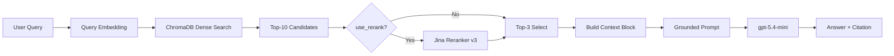

# Architecture — RAG Pipeline (Day 08 Lab)

## 1. Tổng quan kiến trúc

```text
[Raw Docs]
    ↓
[index.py: Preprocess → Chunk → Embed → Store]
    ↓
[ChromaDB Vector Store]
    ↓
[rag_answer.py: Query → Dense Retrieve → Optional Rerank → Generate]
    ↓
[Grounded Answer + Citation]
```

**Mô tả ngắn gọn:**
Hệ thống này là một RAG pipeline nhỏ cho bài lab Day 08, dùng để trả lời câu hỏi nội bộ dựa trên 5 tài liệu policy và SOP thuộc các nhóm IT, CS, HR. Mục tiêu là tạo câu trả lời ngắn, có citation, và ưu tiên grounded theo đúng evidence trong tài liệu thay vì trả lời theo kiến thức ngoài.

---

## 2. Indexing Pipeline (Sprint 1)

### Tài liệu được index
| File | Nguồn | Department | Số chunk |
|------|-------|-----------|---------|
| `policy_refund_v4.txt` | `policy/refund-v4.pdf` | CS | 6 |
| `sla_p1_2026.txt` | `support/sla-p1-2026.pdf` | IT | 5 |
| `access_control_sop.txt` | `it/access-control-sop.md` | IT Security | 8 |
| `it_helpdesk_faq.txt` | `support/helpdesk-faq.md` | IT | 6 |
| `hr_leave_policy.txt` | `hr/leave-policy-2026.pdf` | HR | 5 |

Tổng cộng corpus hiện tại có **5 tài liệu / 30 chunks**.

### Quyết định chunking
| Tham số | Giá trị | Lý do |
|---------|---------|-------|
| Chunk size | 400 tokens (xấp xỉ theo ký tự) | Giữ mỗi chunk đủ rộng để chứa trọn một policy section nhưng vẫn ngắn enough cho retrieval + prompt |
| Overlap | 80 tokens (cấu hình sẵn) | Dự phòng cho tuning; implementation hiện tại chủ yếu split theo heading/paragraph nên overlap chưa được áp explicit |
| Chunking strategy | Heading-based, fallback paragraph-based | Ưu tiên giữ nguyên nghĩa theo từng section `=== ... ===`, chỉ chia nhỏ khi section quá dài |
| Metadata fields | `source`, `section`, `effective_date`, `department`, `access` | Phục vụ citation, filter, debug retrieval và kiểm tra freshness |

### Embedding model
- **Model**: `jina-embeddings-v5-text-small`
- **Embedding tasks**:
  - Index time: `retrieval.passage`
  - Query time: `retrieval.query`
- **Vector store**: ChromaDB (`PersistentClient`)
- **Similarity / ranking signal**: ứng dụng đọc `distances` từ Chroma và quy đổi thành `score = 1 - distance`

---

## 3. Retrieval Pipeline (Sprint 2 + 3)

### Baseline (Sprint 2)
| Tham số | Giá trị |
|---------|---------|
| Strategy | Dense retrieval (embedding similarity) |
| Top-k search | 10 |
| Top-k select | 3 |
| Rerank | Không |

### Variant (Sprint 3)
| Tham số | Giá trị | Thay đổi so với baseline |
|---------|---------|------------------------|
| Strategy | Dense retrieval + rerank | Giữ dense retrieval, thêm bước reorder candidate trước khi generate |
| Top-k search | 10 | Không đổi |
| Top-k select | 3 | Không đổi |
| Rerank | `jina-reranker-v3` qua Jina API | Bật `use_rerank=True` |
| Query transform | Không dùng | Không đổi |

**Lý do chọn variant này:**
Baseline đã đạt **Context Recall = 5.0/5**, nghĩa là pipeline thường lấy đúng nguồn cần thiết nhưng chưa phải lúc nào cũng ưu tiên đúng chunk quan trọng nhất vào prompt. Điều đó thể hiện rõ ở `q06`, nơi baseline có recall đủ nhưng completeness chỉ **1/5**; vì vậy nhóm chọn rerank để sửa bài toán **selection/order of evidence**, thay vì đổi sang hybrid để tăng recall.

---

## 4. Generation (Sprint 2)

### Grounded Prompt Template
```text
Answer only from the retrieved context below.
If the context is insufficient, say you do not know.
Cite the source field when possible.
Keep your answer short, clear, and factual.

Question: {query}

Context:
[1] {source} | {section} | score={score}
{chunk_text}

[2] ...

Answer:
```

### LLM Configuration
| Tham số | Giá trị |
|---------|---------|
| Model | `gpt-5.4-mini` |
| Temperature | 0 |
| Max tokens | 512 |

---

## 5. Failure Mode Checklist

> Dùng khi debug theo thứ tự: index → retrieval → rerank/select → generation

| Failure Mode | Triệu chứng | Cách kiểm tra |
|-------------|-------------|---------------|
| Index lỗi | Retrieve về docs cũ / sai version | Kiểm tra metadata `source`, `effective_date`, `department` trong index |
| Chunking tệ | Chunk cắt giữa điều khoản hoặc section quá dài | Đọc preview chunk từ `chunk_document()` / `list_chunks()` |
| Retrieval recall thấp | Không lấy được expected source | So `context_recall` trong `ab_comparison.csv` |
| Ranking/select lỗi | Đã retrieve đúng source nhưng answer thiếu ý chính | So sánh `chunks_used` giữa baseline và rerank, đặc biệt ở `q06` |
| Generation không grounded | Answer thêm chi tiết ngoài context | So `faithfulness_notes`, ví dụ `q10` |
| Abstain chưa tốt | Câu hỏi ngoài docs vẫn trả lời quá cụ thể | Kiểm tra các câu insufficient-context như `q09`, `q10` |

**Quan sát từ kết quả hiện tại:**
- Điểm nghẽn chính không nằm ở recall, vì cả baseline và variant đều đạt `Context Recall = 5.0/5`.
- Lỗi nổi bật nhất là `generation grounding` ở `q10` và `evidence selection` ở `q06`.

---

## 6. Diagram


