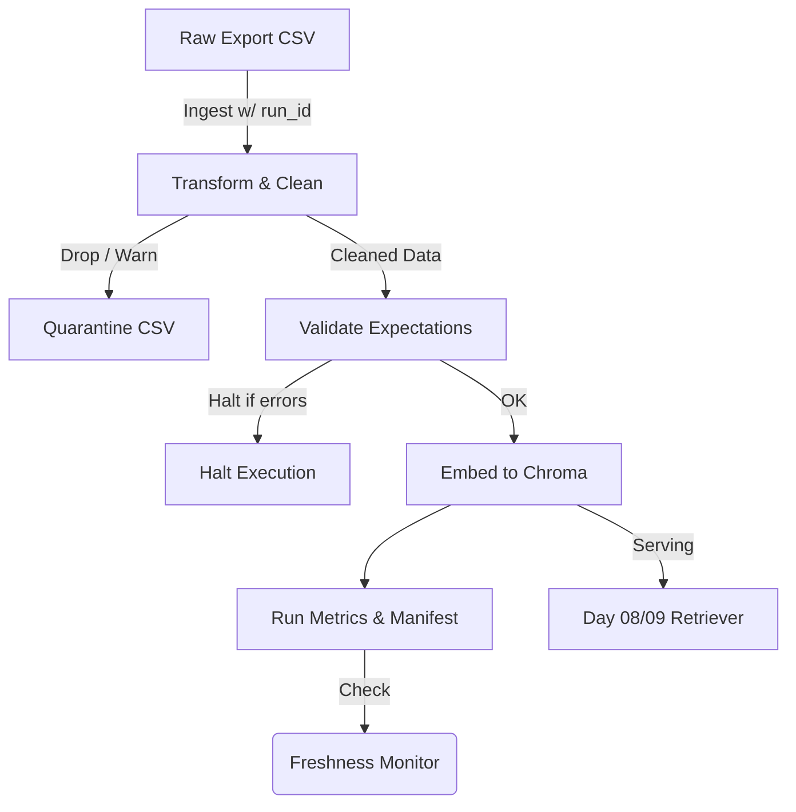

# Kiến trúc pipeline — Lab Day 10

**Nhóm:** C401-B2  
**Cập nhật:** 15/04/2026

---

## 1. Sơ đồ luồng (bắt buộc có 1 diagram: Mermaid / ASCII)

---

## 2. Ranh giới trách nhiệm

| Thành phần | Input | Output | Owner nhóm |
|------------|-------|--------|--------------|
| Ingest | `data/raw/policy_export_dirty.csv` | Raw records, `run_id` | Ingestion Owner |
| Transform | Raw records | Cleaned records, Quarantine CSV | Cleaning Owner |
| Quality | Cleaned records | Validation results (Pass/Halt) | Quality Owner |
| Embed | Validated records | Upserted ChromaDB collection | Embed Owner |
| Monitor | Manifest data | Freshness Check Check (Pass/Warn/Fail) | Monitoring Owner |

---

## 3. Idempotency & rerun

- **Strategy:** Upsert trực tiếp theo `chunk_id` vào Chroma. Điều này giúp chạy nhiều lần (`rerun`) không làm nhân bản dữ liệu vector.
- **Rerun 2 lần:** Không bị clone vì Chromadb `.upsert()` sẽ ghi đè record có ID bị trùng.
- **Pruning:** Snapshot publish lúc cuối của pipeline tiến hành xóa tất cả index IDs trên Chroma không còn tồn tại trong list file cleaned mới nhất.

---

## 4. Liên hệ Day 09

- Pipeline Day 10 giúp vệ sinh các documents dùng trong hệ thống (như versioning và rules), xuất ra bản Cleaned rồi Embed vào `day10_kb`.
- Các Multi-Agent từ Day 09 có thể tham chiếu trực tiếp đến ChromaDB Collection `day10_kb` này thông qua Embeding Function và Vector Store. Việc tách riêng collection giúp không bị trộn lẫn chunk sạch/bẩn.

---

## 5. Rủi ro đã biết

- **Freshness SLA failed:** Nếu quá 24h không ingest new data snapshot, manifest sẽ sinh ra cảnh báo.
- **Vector dimension mismatch:** Có thể xảy ra nếu user thay đổi file local embedding mà không delete old chroma DB. Pipeline đã có exception handling cho việc reset collection.
